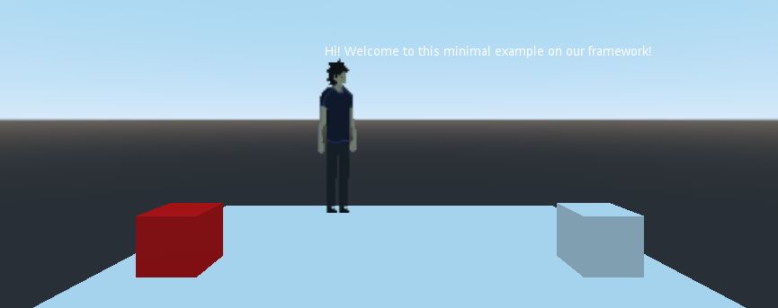

# PACGD - A Point And Click System for [Godot](https://godotengine.org/)

PACGD is a Point and Click system built with the user in mind. Our main goal is to make a FAST, LIGHTWEIGHT, and USER-FRIENDLY system to create point and click games.

### Documentation
Coming soon!

### Minimal Example
This repository includes a minimal example on how to use our plugin.

### A More Complex Example
You may want to visit [https://github.com/gagdiez/personal_godot](https://github.com/gagdiez/personal_godot) to find a more complex example on how to use the plugin.

